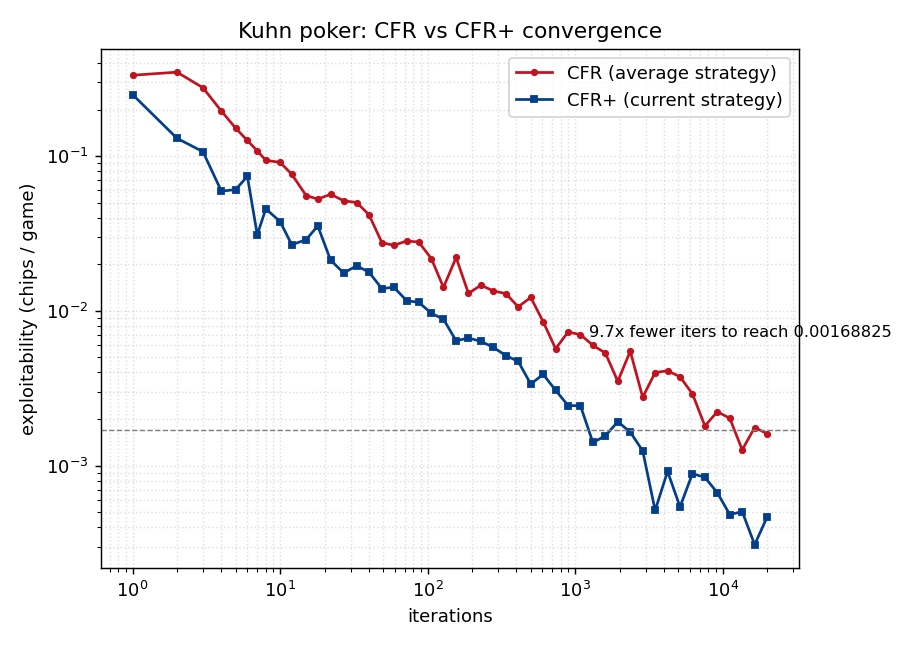
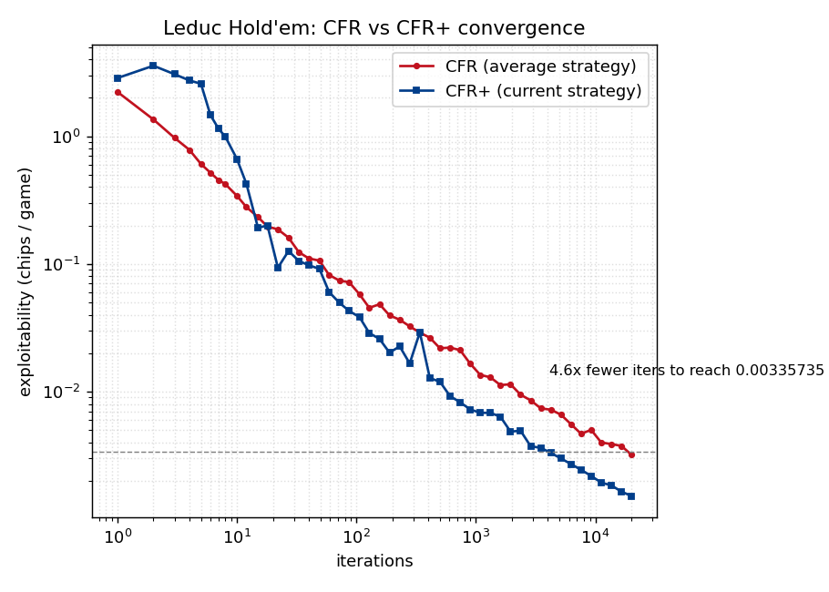

# CFR Poker Bot

Counterfactual Regret Minimization (**CFR** and **CFR+**) solvers for two
benchmark imperfect-information poker games — **Kuhn poker** and **Leduc
Hold'em** — implemented from the original papers and **validated against ground
truth**: the solver reproduces Kuhn poker's closed-form game value of **−1/18**
and its analytic equilibrium family, and a best-response evaluator drives
measured **exploitability to 9×10⁻⁴ chips/game on Kuhn and ~1.5×10⁻³ on Leduc**.

Most hobby CFR repos print a strategy and stop. The point of this one is
self-validation: Kuhn poker has a known closed-form answer, so a correct solver
*must* recover it — that's a checkable correctness proof, not a vibe.

```
Implemented CFR / CFR+ from the original papers to solve Kuhn and Leduc poker to
a near-Nash equilibrium; validated against Kuhn's analytic value (−1/18), drove
exploitability to 1.5e-3 chips/game with a best-response evaluator, showed CFR+
converging up to ~10x faster than vanilla CFR, and beat fixed baselines by
38–72 bb/100 over 100k self-play hands.
```

## Results

### Kuhn poker — validated against the closed-form solution

| Quantity | Result | Ground truth |
|---|---|---|
| Information sets | **12** | 12 |
| Game value to player 0 | **−0.055555** | −1/18 = −0.055556 |
| \|value − (−1/18)\| | **4×10⁻⁷** | 0 |
| Exploitability (CFR+, 5k iters) | **9.3×10⁻⁴** chips/game | 0 at Nash |
| Opener King-bet ÷ Jack-bet | **3.00** | 3 (α-family) |
| Opener Queen-bet probability | **0.000** | 0 |

Kuhn's Nash equilibria form a one-parameter family: bet the Jack with
probability α and the King with probability 3α. The solver recovers exactly this
relationship (King-bet = 3 × Jack-bet) and never bets the Queen as the opener —
independent confirmation the strategy is a genuine equilibrium, not just a
low-exploitability blob.

### Leduc Hold'em — scaling up with CFR+

| Quantity | Result |
|---|---|
| Information sets | **288** |
| Game-tree nodes | **9,451** |
| Exploitability (CFR+, 20k iters) | **1.5×10⁻³** chips/game |
| Solve speed | **≈30 ms/iteration** (single-threaded Python) |

### CFR+ converges an order of magnitude faster

CFR+ (Tammelin 2014) pairs regret-matching⁺ with alternating updates; a hallmark
result is that its **current** strategies converge to equilibrium, whereas
vanilla CFR converges only in the time-**average** (its current strategy
oscillates forever). Comparing each algorithm's canonical output:

- **Kuhn:** CFR+ reaches CFR's best exploitability (1.7×10⁻³ at 20k iters) in
  **~9.7× fewer iterations** (~1,240 vs ~12,000).
- **Leduc:** CFR+ reaches CFR's best exploitability (3.4×10⁻³ at 20k iters) in
  **~4.6× fewer iterations** (~4,100 vs ~18,900).




### Baseline gauntlet

The solved (near-Nash) strategy played against three fixed opponents over 100k
hands (seated in both positions to remove positional bias). The **exact**
expected value is computed by a full tree walk; the **Monte Carlo** estimate
carries a 95% confidence interval, and the two agree — a cross-check that the
simulator and the solver tell the same story.

Leduc Hold'em, solved strategy (CFR+, 6k iters):

| Baseline | Exact bb/100 | Monte Carlo bb/100 (95% CI) |
|---|---|---|
| random | **+72.3** | +73.1 ± 2.7 |
| call_station | **+62.4** | +62.2 ± 2.3 |
| always_raise | **+38.1** | +37.8 ± 4.2 |

## Live demo

An interactive version runs at **[poker.sahilmenon.com](https://poker.sahilmenon.com)**:
play hands against the solved bot for both games, with the equilibrium action
frequencies shown on request. It runs entirely in the browser. The CFR+
strategies are exported to `web/data/*.json`, and a small JS reimplementation of
the rules (`web/engine.js`) looks up the bot's move. `web/selfcheck.js` verifies
the JS engine produces byte-identical information-set keys to the Python solver
(12 for Kuhn, 288 for Leduc) so the lookups can't silently drift.

### Deploy (Cloudflare Pages)

The `web/` folder is static, with no build step.

1. Regenerate the data after any solver change: `python scripts/export_web.py`.
2. In Cloudflare Pages, create a project from this repo with **build command:** none
   and **build output directory:** `web`.
3. Under Custom domains, add `poker.sahilmenon.com` (DNS is auto-managed for a
   domain already on Cloudflare).

## How it works

An **extensive-form game** interface (`cfr_poker/games/base.py`) exposes chance
nodes, player decision nodes, information-set keys and terminal utilities. Each
game is compiled once into a flat **game tree** (`cfr_poker/tree.py`) with shared
information-set ids so the inner loops never re-walk the abstract game — that is
what makes Leduc solve in milliseconds per iteration.

- **`cfr_poker/cfr.py`** — one game-agnostic traversal implements both vanilla
  CFR (regret matching, simultaneous updates, uniform averaging) and CFR+
  (regret-matching⁺, alternating updates, linear averaging). Utilities are
  tracked in player 0's frame and sign-flipped for the acting player, so the
  same code is correct through chance nodes and round transitions.
- **`cfr_poker/best_response.py`** — the exploitability evaluator. A best
  response must commit one action per information set (it can't see hidden
  cards), so it aggregates each info set's reach-weighted action values before
  choosing — the piece that makes "exploitability = X" defensible.
- **`cfr_poker/analytic.py`** — Kuhn's ground-truth facts (value −1/18, the
  α-family) used as correctness checks.
- **`cfr_poker/baselines.py`** — fixed opponents (random, call-station,
  always-raise) and the exact + Monte-Carlo gauntlet.

## Quickstart

```bash
pip install -r requirements.txt

python scripts/run_kuhn.py                 # validate Kuhn against −1/18
python scripts/run_leduc.py --iters 20000  # solve Leduc with CFR+
python scripts/plot_convergence.py         # write figures/*.png, print speedups
python scripts/gauntlet.py --game leduc     # solved strategy vs fixed baselines
python scripts/export_web.py               # refresh the browser demo's data

pytest                                     # 19 tests: structure, ground truth, gauntlet
node web/selfcheck.js                      # JS/Python info-set-key parity for the demo
```

## Project layout

```
cfr_poker/
  games/base.py     abstract extensive-form game interface
  games/kuhn.py     Kuhn poker (3 cards, 12 info sets)
  games/leduc.py    Leduc Hold'em (6 cards, 2 rounds, 288 info sets)
  tree.py           compile a game into a flat node array
  cfr.py            vanilla CFR and CFR+ solver
  best_response.py  best-response / exploitability evaluator
  evaluate.py       exact expected-value tree walk
  analytic.py       Kuhn ground-truth (−1/18, α-family)
  baselines.py      fixed opponents + exact/Monte-Carlo gauntlet
  experiments.py    convergence curves and speedup measurement
scripts/            runnable entry points (solve, plot, gauntlet, export_web)
tests/              pytest suite
web/                interactive browser demo (Cloudflare Pages)
  engine.js         Kuhn + Leduc rules in JS, keyed identically to Python
  app.js            play-against-the-bot UI
  data/*.json       exported CFR+ strategies
  selfcheck.js      JS/Python info-set-key parity check (Node)
```

## Scope

Deliberately bounded to stay finishable and checkable: no deep learning (no Deep
CFR), no no-limit, no card abstraction. The browser demo just plays the exported
strategies; it isn't part of the solver. The value is a faithful, self-validating
reproduction of two published results.

## References

- Zinkevich, Johanson, Bowling, Piccione (2007), *Regret Minimization in Games
  with Incomplete Information* — the original CFR paper.
- Tammelin (2014), *Solving Large Imperfect Information Games Using CFR+*;
  Bowling et al. (2015, *Science*), *Heads-up Limit Hold'em Poker is Solved*.
- Neller & Lanctot (2013), *An Introduction to Counterfactual Regret
  Minimization* — the canonical tutorial with a Kuhn worked example.
- [OpenSpiel](https://github.com/deepmind/open_spiel) — reference CFR/CFR+
  implementations and Kuhn/Leduc exploitability benchmarks.
- [Kuhn poker](https://en.wikipedia.org/wiki/Kuhn_poker) — analytic α-family and
  the −1/18 game value.
